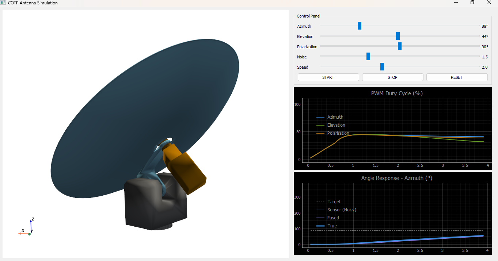
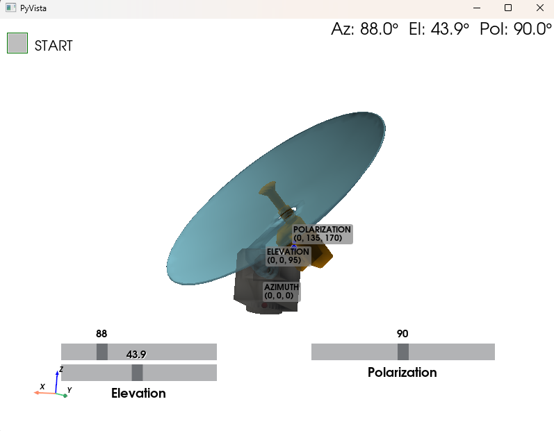
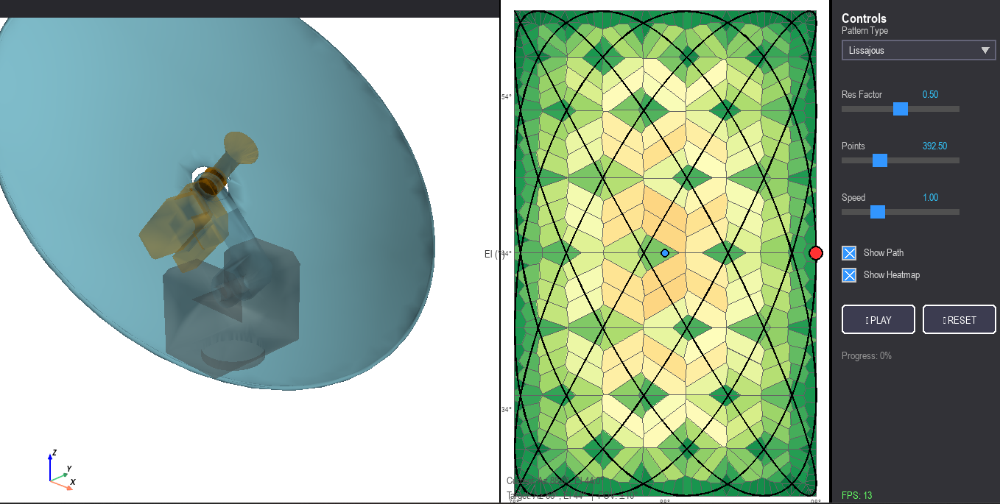
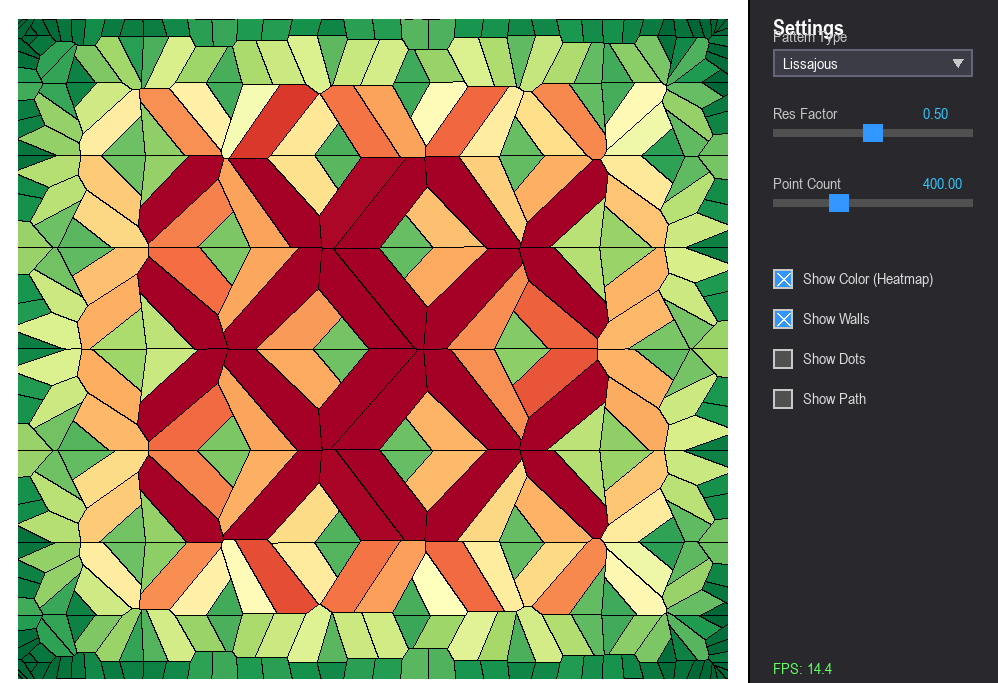

# Antenna Pointing Simulations

  

----

  
  
  

---

This folder contains four simulation programs for antenna pointing and scan pattern analysis:

- pointing_manual_simulation.py
- pointing_pattern_simulation.py
- pointing_resolution_simulations.py
- 

## What Each Script Does

### 1. Manual 3D Joint Control
File: pointing_manual_simulation.py

Purpose:
- Interactive 3D visualization of antenna mechanical links (azimuth, elevation, polarization).
- Lets you manually control each joint with sliders.
- Includes a start animation button that moves the mechanism toward a target angle set.

Key features:
- Loads three STL parts and decimates meshes for speed.
- Uses pivot-based rigid transforms with hierarchical kinematics:
  azimuth -> elevation -> polarization.
- Shows current angle text and pivot markers.
- Supports automatic motion toward:
  - Azimuth 88°
  - Elevation 44°
  - Polarization 90°

Best for:
- Verifying CAD linkage motion and joint behavior.
- Mechanical debugging before adding scan trajectory logic.

---

### 2. Integrated 3D + Pattern Playback
File: pointing_pattern_simulation.py

Purpose:
- Combines a 3D antenna view and a 2D scan-pattern panel in one Pygame window.
- Plays scan trajectories and maps pattern points to real antenna angles around a target.

Key features:
- Left: off-screen PyVista render of the antenna model.
- Middle: scan pattern plane with target marker and current scan position.
- Right: controls for pattern type and playback.
- Supports three scan patterns:
  - Lissajous
  - Spiral
  - Raster
- Converts pattern offsets into commanded angles:
  - Azimuth = target azimuth - pattern x
  - Elevation = target elevation - pattern y
- Optional Voronoi heatmap overlay in the pattern panel.
- Basic camera controls in 3D panel:
  - Mouse wheel zoom
  - Middle mouse pan

Best for:
- End-to-end visualization of how scan trajectories drive antenna motion.
- Comparing coverage patterns while seeing mechanical pose in real time.

---

### 3. High-Speed Resolution/Coverage Visualizer
File: pointing_resolution_simulations.py

Purpose:
- Fast 2D scan coverage and Voronoi-cell analysis using Taichi kernels on GPU.
- Focuses on spatial revisit density and relative resolution of scan patterns.

Key features:
- Taichi kernels generate Lissajous, Spiral, and Raster points.
- Voronoi nearest-site assignment computed per pixel.
- Cell area estimation used as proxy for local coverage density.
- Heatmap coloring with adjustable overlays:
  - Color map
  - Cell walls
  - Sample dots
  - Path line
- Uses reflected boundary points to bound Voronoi behavior near edges.
- Includes percentile-based smoothing of min/max area for stable visualization.

Best for:
- Fast iteration on scan parameters.
- Understanding where coverage is dense vs sparse.

---

## Typical Workflow

1. Start with pointing_manual_simulation.py to validate mechanical motion and pivots.
2. Use pointing_pattern_simulation.py to test trajectory playback in full context.
3. Use pointing_resolution_simulations.py for rapid coverage/resolution tuning.

## Requirements

Python packages used across scripts:
- numpy
- pygame
- pyvista
- scipy
- matplotlib
- taichi

Likely install command:

pip install numpy pygame pyvista scipy matplotlib taichi

Notes:
- PyVista may need a VTK-compatible environment.
- Taichi tries GPU first and falls back to Vulkan in pointing_resolution_simulations.py.
- STL files required by 3D scripts:
  - CADs-Azimuth-Body.stl
  - CADs-Elevation-Body.stl
  - CADs-Polarization-Body.stl

## How To Run

From this simulations folder:

python pointing_manual_simulation.py  
python pointing_pattern_simulation.py  
python pointing_resolution_simulations.py

## Controls Summary

### Manual simulation
- Slider controls for azimuth, elevation, polarization.
- Start checkbox/button triggers animation to target pose.

### Integrated pattern simulation
- Pattern dropdown: Lissajous, Spiral, Raster.
- Pattern-specific slider:
  - Res Factor (Lissajous)
  - Num Turns (Spiral)
  - Num Lines (Raster)
- Common sliders:
  - Points
  - Speed
- Checkboxes:
  - Show Path
  - Show Heatmap
- Buttons:
  - Play
  - Reset
- 3D viewport:
  - Mouse wheel zoom
  - Middle-button pan

### Resolution simulation
- Pattern dropdown with same three pattern families.
- Pattern-specific parameter slider plus point count.
- Visualization toggles:
  - Show Color (Heatmap)
  - Show Walls
  - Show Dots
  - Show Path

## Notes on Interpretation

- Smaller Voronoi cells generally indicate denser sampling (higher revisit).
- Larger cells indicate sparser coverage.
- Pattern tuning trades off uniformity, revisit behavior, and motion style.
